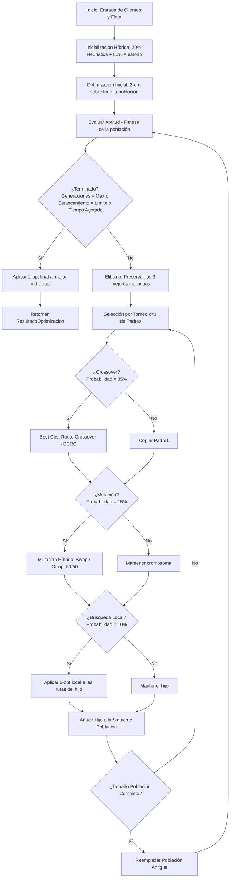

# Auditoría Técnica y Documentación del Optimizador Evolutivo (CVRPTW)
## Distribuidora Líder

Este documento presenta una auditoría técnica profunda y detalla la documentación del algoritmo genético memético implementado para resolver el problema de ruteo vehicular con capacidad limitada (CVRP) y restricciones de jornada laboral/almuerzo de la **Distribuidora Líder**.

---

## 1. Introducción

El sistema tiene como objetivo optimizar las rutas de entrega de una flota heterogénea de vehículos que parten desde un único depósito para abastecer a una serie de clientes distribuidos geográficamente. El problema se modela como un **CVRPTW (Capacitated Vehicle Routing Problem with Time Windows)** adaptado con las siguientes particularidades del negocio:

1. **Flota Heterogénea**: Cada vehículo $k$ posee una capacidad máxima de volumen de carga diferente ($C_k$).
2. **Ventanas de Tiempo y Jornada**: Cada ruta no debe exceder una jornada laboral de **480 minutos** (8 horas).
3. **Servicio Dinámico**: El tiempo de descarga en cada cliente depende del volumen de su pedido.
4. **Almuerzo Obligatorio**: Se debe inyectar una pausa de **60 minutos** (refrigerio) si el tiempo acumulado de la ruta del conductor se encuentra en la ventana de **240 a 360 minutos** (horas de almuerzo).

El proyecto se estructura bajo los principios de **Clean Architecture**, dividiendo claramente las responsabilidades en capas:
- `core/models/domain.py`: Define los objetos de negocio libres de infraestructura.
- `application/use_cases/optimize_route.py`: Coordina la obtención de datos, cálculo de matrices geográficas de distancia/tiempo con la fórmula de Haversine, y ejecución del optimizador.
- `infrastructure/optimizer/genetic_optimizer.py`: Contiene el motor heurístico del algoritmo genético memético.

---

## 2. Metodología y Formulación Matemática

El algoritmo genético representa las soluciones utilizando un **cromosoma basado en permutaciones con delimitadores**.

### 2.1 Representación del Cromosoma

Para un problema con $N$ clientes y $M$ vehículos, un individuo se representa como un arreglo $X$ de tamaño $N + M - 1$:

$$X = [g_1, g_2, \dots, g_{N+M-1}]$$

Donde:
* Los genes con valor **positivo** $g_i \in \{1, 2, \dots, N\}$ representan a los clientes.
* Los genes con valor **no positivo** $g_i \le 0$ (por ejemplo: $0, -1, -2, \dots, -(M-2)$) representan los delimitadores que separan las rutas de los $M$ vehículos.

Esta representación divide el cromosoma de manera natural en $M$ sub-rutas $(R_1, R_2, \dots, R_M)$.

---

### 2.2 Formulación Matemática de la Función de Aptitud (Fitness)

El objetivo es minimizar los costos totales de transporte, penalizando estrictamente las violaciones a la capacidad de los vehículos y la jornada de trabajo diaria.

#### 1. Distancia de Viaje Total ($D_{total}$)
Dada la ruta de un vehículo $k$, expresada como la secuencia de nodos visitados $R_k = (r_{k, 0}, r_{k, 1}, \dots, r_{k, L_k}, r_{k, L_k+1})$, donde $r_{k,0} = 0$ (depósito) y $r_{k, L_k+1} = 0$ (retorno al depósito):

$$D(R_k) = \sum_{i=0}^{L_k} d(r_{k, i}, r_{k, i+1})$$

$$D_{total} = \sum_{k=1}^{M} D(R_k)$$

Donde $d(a, b)$ es la distancia de Haversine entre el nodo $a$ y el nodo $b$.

#### 2. Penalidad por Exceso de Capacidad ($P_{cap}$)
Sea $q_j$ el volumen del pedido del cliente $j$ (con $q_0 = 0$ en el depósito). La carga total asignada al vehículo $k$ es:

$$Q(R_k) = \sum_{i=1}^{L_k} q_{r_{k, i}}$$

Dado un vehículo $k$ con capacidad de volumen $C_k$, el exceso se define como:

$$E_{cap, k} = \max\left(0, Q(R_k) - C_k\right)$$

La penalización total por capacidad está regulada por el peso $\alpha$:

$$P_{cap} = \alpha \sum_{k=1}^{M} E_{cap, k}$$

#### 3. Penalidad por Exceso de Jornada Laboral ($P_{time}$)
El tiempo de servicio $S(j)$ en el cliente $j$ se calcula dinámicamente según su volumen de pedido:

$$S(j) = \begin{cases} 
10.0 \text{ min} & \text{si } q_j \le 5.0 \\ 
20.0 \text{ min} & \text{si } 5.0 < q_j \le 15.0 \\ 
35.0 \text{ min} & \text{si } q_j > 15.0 
\end{cases}$$

El tiempo acumulado de llegada al cliente $r_{k, i}$ se define recursivamente como:

$$t_{k, i}' = t_{k, i-1} + \tau(r_{k, i-1}, r_{k, i})$$

Donde $\tau(a, b)$ es el tiempo de viaje entre $a$ y $b$. A este tiempo se le añade el almuerzo obligatorio $T_{lunch, k} = 60$ minutos si entra en el rango $[240.0, 360.0]$ minutos de jornada y no ha sido tomado con anterioridad:

$$t_{k, i}'' = \begin{cases} 
t_{k, i}' + 60.0 & \text{si } 240.0 \le t_{k, i}' \le 360.0 \text{ y no se ha tomado el almuerzo} \\ 
t_{k, i}' & \text{en caso contrario} 
\end{cases}$$

El tiempo de salida del cliente es:

$$t_{k, i} = t_{k, i}'' + S(r_{k, i})$$

El tiempo total de la ruta de conducción $T_k$ al regresar al depósito es:

$$T_k = t_{k, L_k} + \tau(r_{k, L_k}, 0)$$

La jornada máxima permitida es de $480$ minutos. El exceso de tiempo acumulado es:

$$E_{time, k} = \max\left(0, T_k - 480.0\right)$$

La penalización total por tiempo laboral regulada por el peso $\beta$ es:

$$P_{time} = \beta \sum_{k=1}^{M} E_{time, k}$$

#### 4. Función de Costo Total ($F_{cost}$) y Aptitud ($Fitness$)
La función de costo objetivo del individuo combina el costo de viaje y las penalidades acumuladas:

$$F_{cost} = D_{total} + P_{cap} + P_{time}$$

Para maximizar el éxito evolutivo de los individuos de menor costo, la función de aptitud ($Fitness$) se define de forma inversamente proporcional:

$$Fitness(X) = \frac{1}{F_{cost}(X)}$$

---

## 3. Pseudocódigo Detallado

A continuación se presenta el pseudocódigo estructurado del ciclo de vida del algoritmo evolutivo memético:

```text
ALGORITMO CVRPTW_Memetico
    ENTRADA: Clientes, Vehículos, MatrizDistancias, MatrizTiempos, Parametros (num_individuos, max_generaciones, limite_estancamiento, alpha, beta)
    SALIDA: MejorIndividuo, DetalleRutas

    // 1. Inicialización Híbrida
    Población ← Ø
    num_heuristica ← ParteEntera(num_individuos * 0.20)
    
    // Semillas heurísticas
    CW_Indiv ← Ejecutar_Clarke_Wright_Ahorros(Clientes, Vehículos, MatrizDistancias)
    NN_Indiv ← Generar_Vecino_Mas_Cercano(Clientes, Vehículos, MatrizDistancias)
    HeurísticasPool ← {CW_Indiv, NN_Indiv}
    
    // Rellenar cuota heurística aplicando mutaciones ligeras (diversidad inicial)
    MIENTRAS Tamaño(Población) < num_heuristica HACER
        SI HeurísticasPool no está vacío ENTONCES
            base ← ElegirAleatorio(HeurísticasPool)
            indiv ← Copiar(base)
            indiv ← AplicarSwapAleatorio(indiv)
        SINO
            indiv ← GenerarIndividuoAleatorio()
        FIN SI
        Población ← Población U {indiv}
    FIN MIENTRAS
    
    // Rellenar con aleatorios puros
    MIENTRAS Tamaño(Población) < num_individuos HACER
        Población ← Población U {GenerarIndividuoAleatorio()}
    FIN MIENTRAS

    // 2. Búsqueda Local Inicial (Memética)
    PARA cada indiv en Población HACER
        indiv ← OptimizarLocalSearch2Opt(indiv, MatrizDistancias)
    FIN PARA

    MejorIndividuo ← NULO
    MejorFitness ← -1.0
    ContadorEstancamiento ← 0

    // 3. Ciclo Evolutivo Principal
    PARA gen DESDE 1 HASTA max_generaciones HACER
        
        // Evaluación de la aptitud
        PuntajesFitness ← EvaluarAptitud(Población, Clientes, Vehículos, MatrizDistancias, MatrizTiempos, alpha, beta)
        
        MejorIdxGen ← IndiceValorMaximo(PuntajesFitness)
        MejorFitGen ← PuntajesFitness[MejorIdxGen]
        
        // Evaluar progreso histórico
        SI MejorFitGen > MejorFitness ENTONCES
            MejorFitness ← MejorFitGen
            MejorIndividuo ← Copiar(Población[MejorIdxGen])
            ContadorEstancamiento ← 0
        SINO
            ContadorEstancamiento ← ContadorEstancamiento + 1
        FIN SI
        
        // Condiciones de parada anticipada
        SI ContadorEstancamiento >= limite_estancamiento ENTONCES
            ROMPER CICLO
        FIN SI
        SI TiempoTranscurrido() >= limite_tiempo_segs ENTONCES
            ROMPER CICLO
        FIN SI
        
        // Elitismo: Preservar las 3 mejores soluciones actuales
        IndicesOrdenados ← OrdenarIndicesDescendente(PuntajesFitness)
        SiguientePoblación ← {Población[IndicesOrdenados[0]], Población[IndicesOrdenados[1]], Población[IndicesOrdenados[2]]}
        
        // Reproducción y Reemplazo
        MIENTRAS Tamaño(SiguientePoblación) < num_individuos HACER
            // Selección por Torneo (k = 3)
            Padre1 ← TournamentSelection(Población, PuntajesFitness, k=3)
            Padre2 ← TournamentSelection(Población, PuntajesFitness, k=3)
            
            // Cruce (Best Cost Route Crossover - BCRC)
            SI NumeroAleatorio(0, 1) < 0.85 ENTONCES
                Hijo ← BestCostRouteCrossover(Padre1, Padre2)
            SINO
                Hijo ← Copiar(Padre1)
            FIN SI
            
            // Mutación Híbrida (Swap u Or-opt)
            SI NumeroAleatorio(0, 1) < 0.15 ENTONCES
                Hijo ← AplicarMutacionHibrida(Hijo)
            FIN SI
            
            // Búsqueda Local Memética con probabilidad pequeña
            SI NumeroAleatorio(0, 1) < 0.10 ENTONCES
                Hijo ← OptimizarLocalSearch2Opt(Hijo, MatrizDistancias)
            FIN SI
            
            SiguientePoblación ← SiguientePoblación U {Hijo}
        FIN MIENTRAS
        
        Población ← SiguientePoblación
    FIN PARA

    // 4. Pulido Final del mejor individuo
    MejorIndividuo ← OptimizarLocalSearch2Opt(MejorIndividuo, MatrizDistancias)
    
    RETORNAR MejorIndividuo, ObtenerDetalleRutas(MejorIndividuo)
FIN ALGORITMO
```

---

## 4. Detalle de Operadores Genéticos y Búsqueda Local

### 4.1 Selección: Torneo de Tamaño $k=3$
El método de selección por torneo selecciona aleatoriamente $k$ candidatos de la población y otorga el derecho de reproducción al individuo con la aptitud más alta. Un tamaño de torneo de $k=3$ equilibra adecuadamente la **presión de selección** (para promover la convergencia) con la conservación de la **diversidad genética** (evitando que solo los mejores se reproduzcan y colapsen la población rápidamente).

### 4.2 Cruce (Crossover): Cruce por Ruta de Mejor Costo (BCRC)
El operador estándar de cruce por un punto o uniforme degrada fuertemente las agrupaciones válidas en problemas de ruteo. Por ello, se implementa **BCRC (Best Cost Route Crossover)**, idóneo para problemas VRP:

1. Sean los cromosomas del `Padre1` y `Padre2` divididos en sus respectivas sub-rutas.
2. Selecciona aleatoriamente una ruta no vacía $R_1^*$ del `Padre1`. Extrae el conjunto de clientes pertenecientes a dicha ruta: $C^* = \{c_1, c_2, \dots, c_m\}$.
3. Elimina los clientes de $C^*$ de todas las sub-rutas de `Padre2`.
4. Re-inserta recursivamente cada cliente $c \in C^*$ en la mejor posición de inserción posible dentro del `Padre2`.
   Para cada sub-ruta $k$ y posición de inserción $i$, se evalúa el incremento del costo local:

$$\Delta Costo(c, k, i) = \Delta Distancia(c, k, i) + \alpha \cdot \Delta ExcesoCapacidad(c, k)$$

Donde:
* $\Delta Distancia(c, k, i) = d(r_{k, i}, c) + d(c, r_{k, i+1}) - d(r_{k, i}, r_{k, i+1})$
* $\Delta ExcesoCapacidad(c, k) = \max\left(0, Q(R_k) + q_c - C_k\right) - \max\left(0, Q(R_k) - C_k\right)$

El cliente se inserta definitivamente en la coordenada $(k, i)$ que minimice el valor $\Delta Costo$.

**Impacto en la convergencia**: BCRC preserva las agrupaciones espaciales exitosas del `Padre1` al tiempo que aprovecha la distribución y secuenciación heurística del `Padre2`. Esto conduce a una rápida explotación de buenas vecindades de solución.

### 4.3 Mutación Híbrida: Swap y Or-opt
Con una tasa del **15% ($P_m = 0.15$)**, se activa una mutación que decide aleatoriamente (50/50) entre dos estrategias:

* **Mutación Swap**: Intercambia de posición dos genes cualesquiera en el cromosoma de forma aleatoria. Al poder intercambiar un cliente con otro cliente, o un cliente con un delimitador de ruta, tiene un doble impacto: optimiza el orden de visita inter-ruta o ajusta el número total de clientes asignados a un camión.
* **Mutación Or-opt**: Extrae un bloque contiguo de $L \in \{1, 2, 3\}$ clientes de una ruta origen y lo inserta en una ruta destino en un punto aleatorio. Esto reubica grupos completos de entregas que pueden estar localizadas geográficamente cerca, mejorando la coherencia espacial.

**Importancia**: La mutación híbrida es fundamental para inyectar diversidad, rompiendo esquemas de ruteo estancados y permitiendo al algoritmo salir de óptimos locales en valles de aptitud sub-óptimos.

### 4.4 Búsqueda Local (Algoritmo Memético): 2-opt
La búsqueda local actúa como el operador de aprendizaje del algoritmo memético. Se aplica a nivel de cada ruta individual $R_k$ mediante el algoritmo **2-opt**, cuyo objetivo es eliminar cruces de caminos (bucles).

Dada una ruta con una secuencia $(\dots, i, i+1, \dots, j, j+1, \dots)$, se realiza una inversión del segmento entre $i+1$ y $j$. La ganancia en distancia se calcula como:

$$\Delta d = d(i, j) + d(i+1, j+1) - d(i, i+1) - d(j, j+1)$$

Si $\Delta d < 0$, la inversión se adopta de forma inmediata. Para mantener una eficiencia de cómputo en la API en tiempo real, el número de iteraciones locales por llamada se limita a 5.

---

## 5. Diagrama de Flujo del Algoritmo

El flujo lógico del optimizador evolutivo memético se detalla en el siguiente flujo:



---

## 6. Integración con Antigravity

El entorno de **Antigravity** actúa como el asistente agentico experto de desarrollo que interactúa directamente con este algoritmo y su arquitectura de las siguientes formas:

1. **Monitoreo y Ajuste Fino de Hiperparámetros**: Antigravity facilita la calibración de las constantes de penalización $\alpha$ y $\beta$ mediante ejecuciones aisladas de pruebas y el análisis de la convergencia evolutiva.
2. **Auditoría Estructural de la Capa de Dominio**: A través de herramientas de lectura y edición de código, Antigravity mantiene la pureza del dominio (`Cliente`, `Vehiculo`, `ResultadoOptimizacion`), asegurando que las reglas de la API de FastAPI no contaminen los operadores matemáticos puros del algoritmo de ruteo.
3. **Optimización Memética Dirigida**: Antigravity ayuda a implementar e integrar mejoras a la Búsqueda Local (como operadores de intercambio de vecindad inter-ruta) y validar su impacto analizando el historial de fitness devuelto en el contrato DTO de salida de la aplicación.
4. **Ciclo de Verificación**: Mediante scripts de testing automatizado, Antigravity orquesta peticiones JSON concurrentes, verificando la robustez de las validaciones de Pydantic v2 contra la robustez de convergencia en escenarios reales de congestión o flotas heterogéneas.
